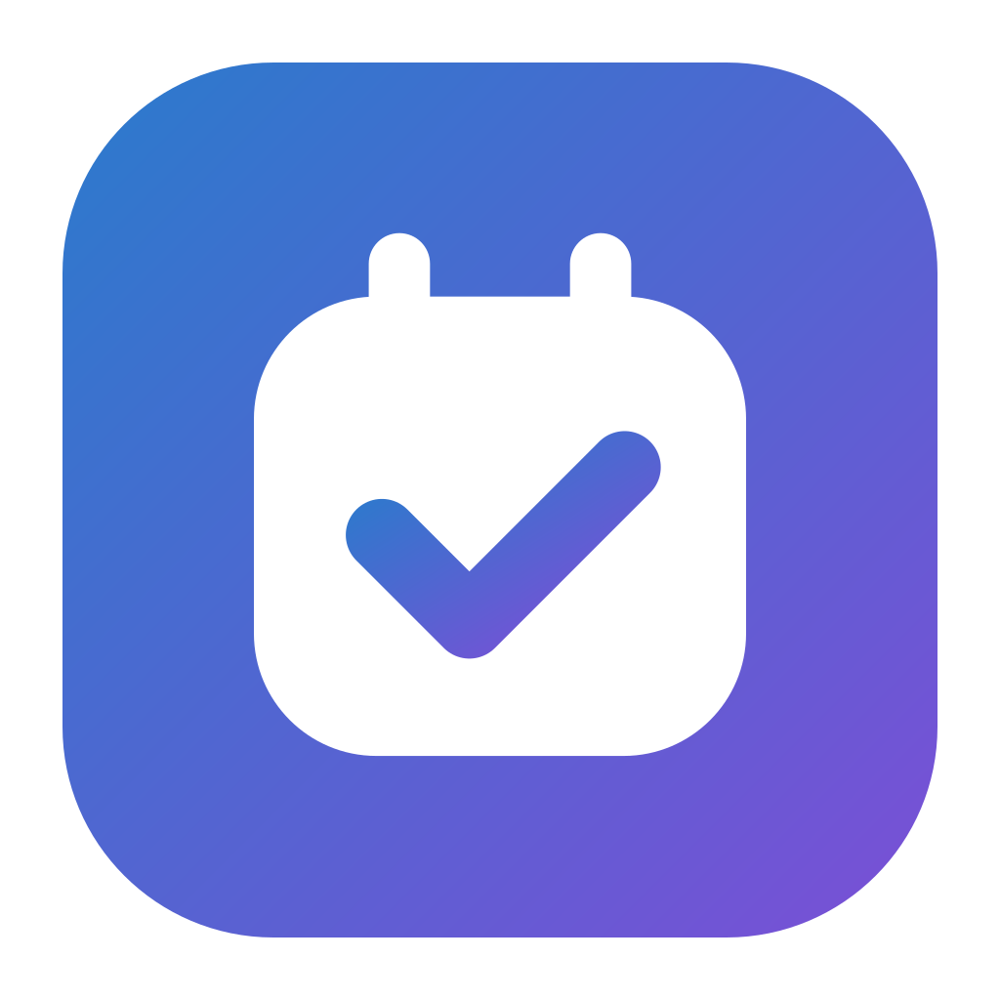
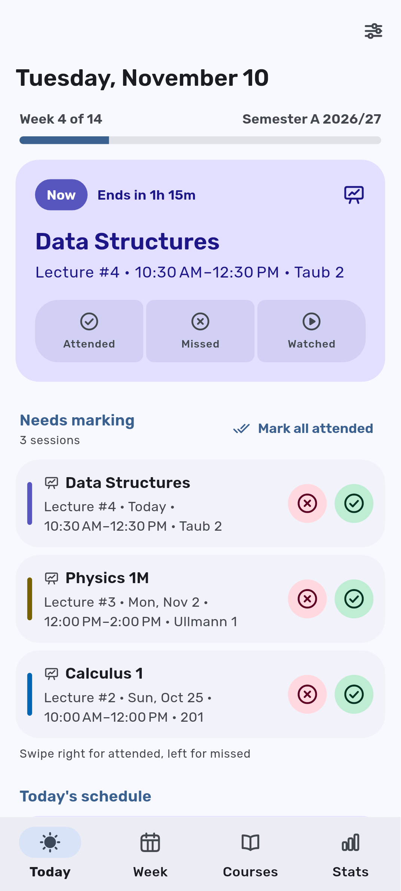
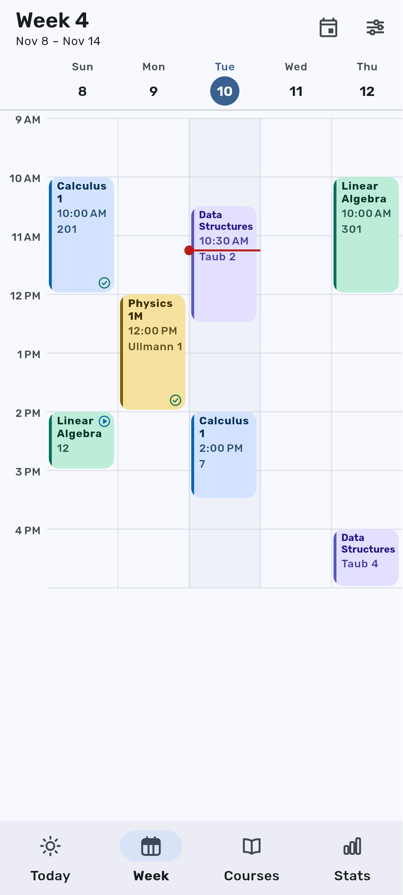
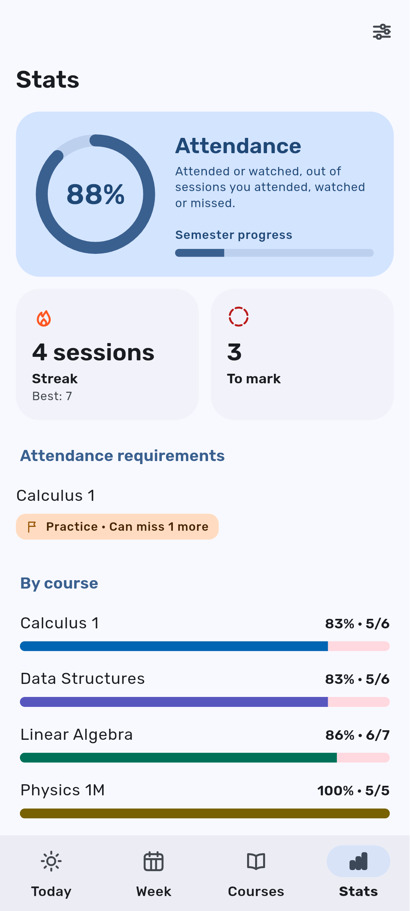
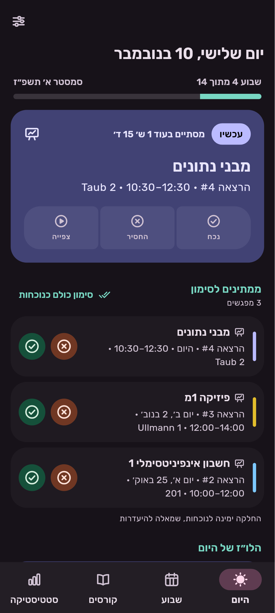
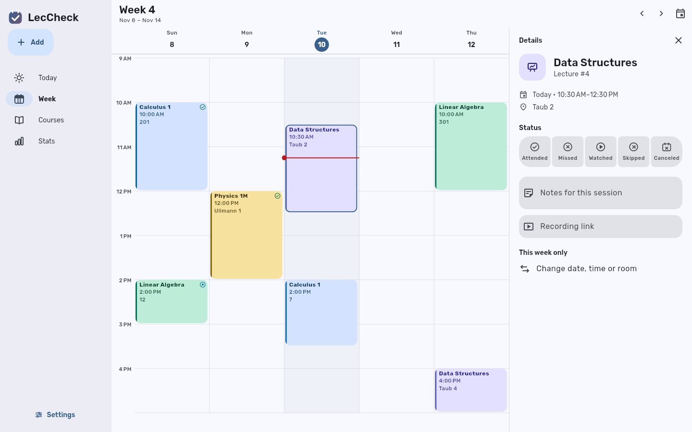

<div align="center">



# LecCheck

**Mark every lecture, practice and lab you attend, and see your semester at a glance.**
Fast, offline-first, and synced live between your phone and computer — for free.

Android · iPhone · Linux · (Windows coming) &nbsp;|&nbsp; English · עברית

</div>

<p align="center">
  
  
  
  
</p>

<p align="center">
  
</p>

LecCheck 2 is a from-scratch rebuild of [LecCheck v1](https://github.com/Emanuel4100/LecCheck).
v1 saved the whole app as one JSON blob and rebuilt every screen on each tap; v2 keeps a
local SQLite database on every device, redraws only what changed, and syncs individual
fields in the background — so it is instant, works offline, and never loses edits.

## Features

- **Today** — what's on now or next with a live countdown, one-tap Attended / Missed /
  Watched, and a "needs marking" queue (swipe right = attended, left = missed, with undo).
- **Week** — swipe between weeks; pinned day headers, a live "now" line, overlapping
  sessions side by side, pinch to zoom, tap a day to mark it as a holiday. Course names
  fit their tiles, with optional short names for long ones.
- **Courses** — attendance ring per course and **attendance requirements**
  ("you can miss 2 more").
- **Stats** — attendance, streaks, per-course and per-type breakdowns, weekly trend,
  and a catch-up list of missed sessions that have a recording.
- **Reminders** — before class (room + link), and after class "How was class?" with
  Attended / Missed / Watched buttons that work **without opening the app**.
- **Android home-screen widget** — today's classes with ✓ / ✗ buttons.
- **Sync** — sign in with Google (optional); changes reach your other devices in ~0.2 s.
  Edits made offline on two devices merge field by field.
- **Material 3 Expressive** design with spring animations, 7 color themes + wallpaper
  colors, pure-black dark mode, custom icon set, English and Hebrew (RTL).
- **Import from v1** — your old LecCheck backup imports with marks, notes, recordings
  and holidays.

## Install

| Platform | How |
|---|---|
| Android | APK from [Releases](https://github.com/Emanuel4100/LecCheck2/releases), or [Obtainium](https://obtainium.imranr.dev) for auto-updates |
| iPhone | Add this source in [AltStore](https://altstore.io) / [SideStore](https://sidestore.io): `https://github.com/Emanuel4100/LecCheck2/releases/latest/download/altstore-source.json` |
| Linux | Download the `linux-x64.tar.gz` from Releases, extract, run `./install.sh` |

## Documentation

| Doc | What's in it |
|---|---|
| [User guide](docs/USER_GUIDE.md) | Every screen and feature, statuses, requirements, reminders, widget, sync |
| [Setup](docs/SETUP.md) | One-time setup: Cloudflare server, Google sign-in, signing key, releases |
| [Architecture](docs/ARCHITECTURE.md) | Data model, occurrence engine, sync design, performance, theming |
| [Development](docs/DEVELOPMENT.md) | Repo layout, toolchain, commands, tests, adding strings/tables/icons |
| [Sync server](server/README.md) | Worker endpoints, wire protocol, merge rules, local dev |
| [Design assets](design/README.md) | Icon font and app-icon pipeline |
| [Roadmap](docs/ROADMAP.md) | What's done, what's next, known limitations |
| [Changelog](CHANGELOG.md) | Release notes |

## Tech stack

| Part | Choice |
|---|---|
| App | Flutter 3.47 (Dart 3.13), `material_ui`, Riverpod 3, go_router, Drift (SQLite) |
| Sync server | Cloudflare Workers + Durable Objects (SQLite), Hono, jose — free plan |
| Notifications / widget | flutter_local_notifications, home_widget + Jetpack Glance |
| CI / releases | GitHub Actions: tests, signed APK, unsigned IPA + AltStore source, Linux tarball |

## Quick start (development)

```bash
mise install                    # Flutter, Java, Node, ninja (pinned in mise.toml)
cd app
flutter pub get
flutter run -d linux            # or an Android device
TZ=Asia/Jerusalem flutter test  # 98 tests
```

Sync needs a server URL at build time: `--dart-define=API_BASE_URL=…` (see
[Setup](docs/SETUP.md)). Without it the app runs fully offline.

## Repository layout

```
app/       Flutter app (Android, iOS, Linux, Windows, macOS)
server/    Cloudflare Worker sync server (TypeScript)
design/    SVG sources for the icon font, app icon and logo
docs/      Documentation
scripts/   Release helpers (Linux installer, AltStore source)
```

## License

LecCheck is free software: you can redistribute it and/or modify it under the terms of
the [GNU General Public License](LICENSE) as published by the Free Software Foundation,
either version 3 of the License, or (at your option) any later version. It is
distributed in the hope that it will be useful, but without any warranty.

Copyright © 2026 Emanuel. The Rubik font is under the
[SIL Open Font License](app/assets/fonts/OFL.txt).
